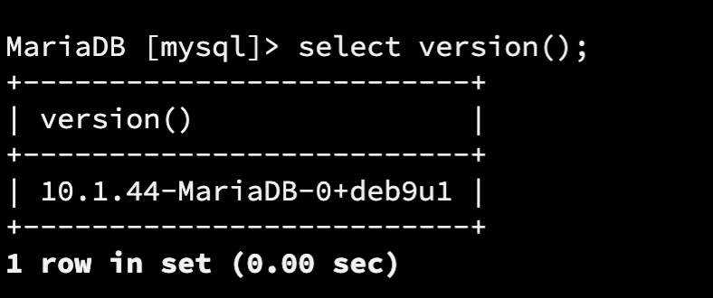
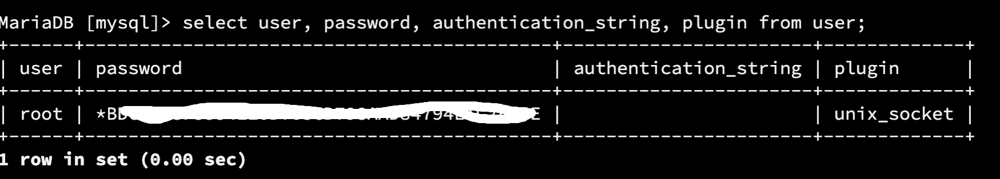

# Mariadb root用户的认证机制

## 用户远程访问
> mariadb远程访问默认是关闭的  

1. mysql 用户允许远程访问
	新增用户授权远程访问
	
	`GRANT ALL ON *.* TO 'admin'@'%' IDENTIFIED BY 'password' 	WITH GRANT OPTION; `  

2. mysql 配置绑定地址允许

	配置文件my.cnf/50-server.cnf(对于debian9上的配置文件） 
	bind-address=xxxx
	注释掉改行--》
	\#bind-address=xxxx  

3. 防火墙没有关闭mysql tcp 端口
默认的root用户  

4. 对于云主机要看安全组是否设置对应端口防火墙

unixt-socket plugin:
