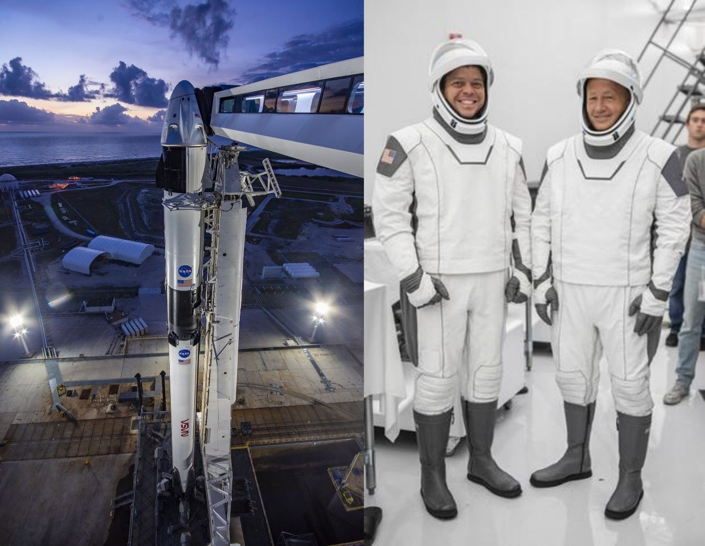

这是我在网路上看到的收集的一些有意思的内容，在这里和大家分享; 欢迎大家推荐认为重要或有趣的东西; 

可以直接在我的 [本项目github仓库](www.github.com/jialigit/myblog)提交issue!

#### 本周新闻
1. SpaceX龙2飞船成功载人首飞

	
	
	北京时间2020年5月31日03时22分，美国太空探索科技公司（SpaceX）用自家猎鹰9号火箭成功发射龙2载人飞船，成功运送两名宇航员（Douglas Hurley和Robert Behnken）进入太空，前往国际空间站，他们将在1天后抵达。火箭一级也实现了成功回收

2. 武汉900万人核酸检测

	

	武汉市在10天内（5月15日～24日）对900万人进行了核酸检测，查出了无症状感染者218人，没有查到确诊患者。同时对这么多人进行检测，全世界恐怕找不到第二例。

3. 地摊经济--人间烟火
	
	
 
	随着疫情的持续，两会的召开，6亿人月收入不足1000的事实也许让很多人不可思议。民生问题持续受到关注，地摊经济成为最近的一个热词，一些地方对地摊经营的商贩开一道门的做法受到社会好评。
	
	应该讲随着政策的持续稳定，政府确实需要转变管理的思维，方法。底层群众的谋生空间大了，同时管理也需要跟上来。防止因为政策一放松，马上就失序的事情发生，到时候政策还是会反弹。因此我觉得这是一个契机，转变政府职能的契机，提升政府执政理念效率的契机，也有可能是新一轮改革的契机。
 
#### 站点推荐

1. [中国红豆词](http://blog.sina.com.cn/s/blog_46b56eea01009lmg.html)

	林昭，一个不该被遗忘的女人，一个值得被所有人尊敬的女人，一个在将来让所有人骄傲的中国人。
	
2. [Github创始人的个人站点【现已停更】](https://jialigit.github.io/2015/06/19/replicated.html)

	Github现在已被微软收购。但是在Github创业的前期，不同于很多创业公司的是它的创始人一开始都是兼职，后来也一直未融资，直到被微软高价收购。由于程序员群体以男性居多，故有人戏称之为gayhub.:)

3. [马克思主义文库](https://www.marxists.org/chinese/index.html)

	*文献非常珍贵, 观点偏左翼。*
	
	```不论这个世界被说成多么美好，但只要剥削、压迫及其根源私有制存在一天，它就不属于劳动人民。
	让我们继续为阶级解放而奋斗。劳动人民终会推翻万恶的剥削制度，获得自由解放。全世界无产阶级大团结万岁！```
	
	
#### 好书推荐  
1. 日瓦戈医生
	
	帕斯捷尔纳克因为这部小说而获得诺贝尔文学奖。小说描写了一位知识分子的形象，也就是日瓦戈医生。它对革命的态度不热情但是又不敢反抗，这种矛盾的心理正好关照当时的苏联时期的社会现状。也正是因为相同的原因，作者并没有去领取诺奖。

	这部根据帕斯捷尔纳克的同名小说改编的电影，英语,是美国人拍摄，不过看里边的演员像是俄国人。
[腾讯电影-日瓦戈医生](https://v.qq.com/x/cover/gkqjqcxx2k3rc49/z0011komstw.html)

2. [thinklikeacomputerscientist【像计算科学家一样思考】](https://runestone.academy/runestone/books/published/thinkcspy/GeneralIntro/intro-TheWayoftheProgram.html)

	很好的一个在线教程，里面也包含了其他基本计算机编程的书籍，数量不多，但是质量相当可以，并且可以使用hypothes工具写笔记。

3. [量化经济学分析](https://quantecon.org)

	Python 和Julia 这两种语言的学习教程，提供PDF和Notebook两个版本，从入门到高级，内容和形式都非常好。如果你正好是经济分析相关的学生或从事相关工作，这个网站很适合你。
	
4. [统计学思维](http://www.greenteapress.com/thinkstats/)
	
	该站点还以其他书籍，质量不错，对于学习计算机的你很有帮助。
	
****
#### 资源
1. [hypothes 网页社交笔记](https://hypothes.is/)

	这是一个可以帮助你做互联网阅读笔记的浏览器插件（chrome)，最主要的亮点是你可以和他人共享你的笔记同时
	可以看到其他人的笔记。
	
2. [codepen](https://codepen.io)  
	The best place to build, test, 
	and discover front-end code.
	 	 
	最好的构建，测试，发现前端代码的地方。
	我觉得这类平台最大的特色就是把工具和
	社交结合的很好
  
3. [在线看星星网页版](https://stellarium.org)
   
   在线看星星。：）
   
4. [spanishpod101](https://www.spanishpod101.com)

	一个学习西班牙的播客平台。用英语学西语，感觉不错。

5. [国际上有名的世界语学习站点【学吧】](https://lernu.net/en)

	在里面可以认识很多国际朋友，提交作业也会有老师帮你批改,一边学习一边认识全世界各地的朋友。
	
6. [佛典学习](http://ybh.chibs.edu.tw/ui.html)


#### 音 乐

1. 命运
	
	这里介绍命运的两个版本：
	
	【卡拉扬】
	
	赫伯特·冯·卡拉扬（Herbert von Karajan，1908年4月5日－1989年7月16日），出生于萨尔斯堡，奥地利著名指挥家、键盘乐器演奏家和导演。卡拉扬在指挥舞台上活跃60多年。他带领过欧洲众多顶尖的乐团，并且曾和柏林爱乐乐团有过长达34年的合作关系。他热衷于录音和导演，为后人留下了大量的音像资料，包括众多的管弦乐，歌剧录音和歌剧电影，涵括从巴洛克到后浪漫主义欧洲作曲家的作品。其中一些作品，如贝多芬的交响曲还被多次录制。卡拉扬在音乐界享有盛誉，甚至在中文领域被人称为“指挥帝王”。
	
	
	
	<iframe frameborder="no" border="0" marginwidth="0" marginheight="0" width="750" height="110" loading="lazy" sandbox="allow-popups allow-scripts allow-same-origin" src="https://www.xiami.com/webapp/embed-player?autoPlay=1&id=1771248586"></iframe>
	
	
	【托斯卡尼尼】
	
	阿尔图罗·托斯卡尼尼（Arturo Toscanini，1867－1957），意大利指挥家，大提琴演奏家。他的指挥艺术在世界上有着极大的影响，直到20世纪60年代还始终占有绝对统治的地位。他早年主修大提琴，从此专职指挥生涯，近七十年。托斯卡尼尼有着惊人的记忆力，他每次指挥都是背谱演出。他的听力奇佳，能听清每个
	
	

<iframe frameborder="no" border="0" marginwidth="0" marginheight="0" width="750" height="110" loading="lazy" sandbox="allow-popups allow-scripts allow-same-origin" src="https://www.xiami.com/webapp/embed-player?autoPlay=1&id=1772415866"></iframe>


2. 华沙工人进行曲

<iframe frameborder="no" border="0" marginwidth="0" marginheight="0" width="750" height="110" loading="lazy" sandbox="allow-popups allow-scripts allow-same-origin" src="https://www.xiami.com/webapp/embed-player?autoPlay=1&id=1774440536"></iframe>