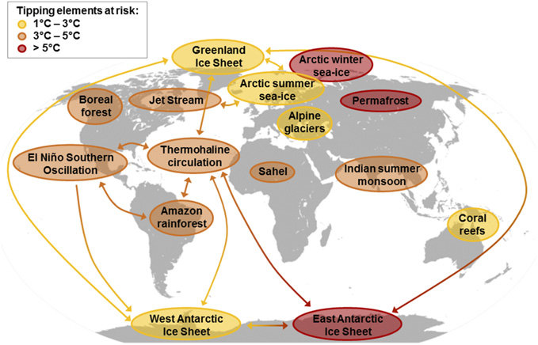
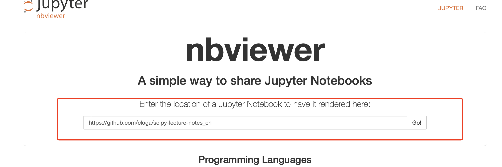

---
layout: weekly

---  

这是我在网路上看到的收集的一些有意思的内容，在这里和大家分享; 欢迎大家推荐认为重要或有趣的东西; 

可以直接在我的 [本项目github仓库](www.github.com/jialigit/myblog)提交issue!

 
[我们的文明还能存在多久？](https://www.resilience.org/stories/2020-06-08/collapse-of-civilisation-is-the-most-likely-outcome-top-climate-scientists/)

后疫情时代， 我们应该彻底反思人类的未来了。大国之间的博弈在地球这个大背景下显得多么幼稚和愚蠢！！！人类解决不平等的状况的办法就是不断的发展经济，但是发展并不是无限的！！！可持续发展不光光是一种理念，而是我们必须面对的现实。

我们正在走向危险的边缘！！！
 

#### 资源

1. jupyter/nbviewer

	- **jupyter** 是一个基于网页（web-based)的markdown写作，脚本运行性的集成环境。你可以一边写论文，一边用代码验证你的想法。默认是支持python, 其他语言(如Julia, R...)需要安装插件。jupyter 包含notebook 和 lab ， 、是
	
	- [nbviewer](https://nbviewer.jupyter.org)
	
   
	viewer 帮助你预览notebook 资源渲染出来的结果。
	
2. [几个爱好者对世界名校计算机课程翻译的库](https://github.com/Kivy-CN)

	主要是数据科学，编程等。

