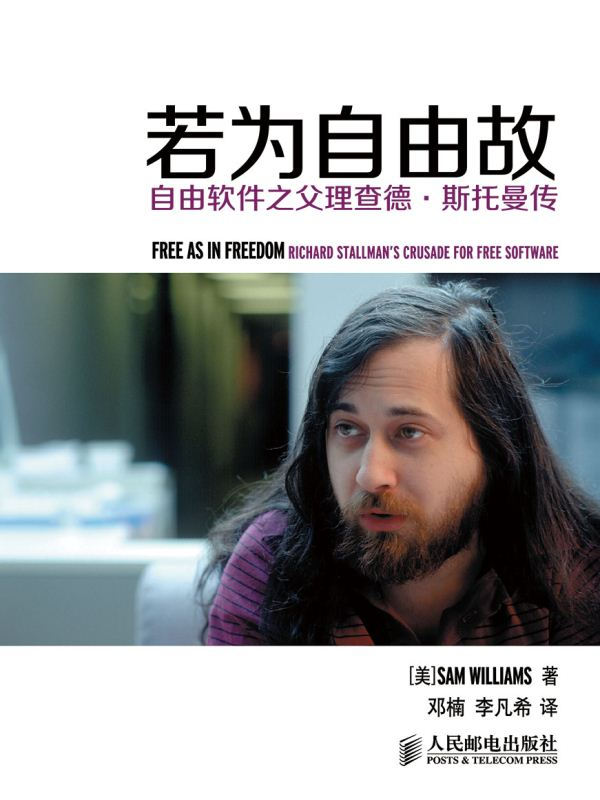

## 读书

1. 自由软件之父理查德.斯托曼  
	[自由软件，自由社会](https://fsfs-zh.readthedocs.io/foreword-trans/)

	[若为自由故：自由软件之父理查德·斯托曼传](https://yuedu.baidu.com/ebook/4173d90484254b35effd3457?pn=1&click_type=10010002&rf=https%3A%2F%2Fcn.bing.com%2F)

	